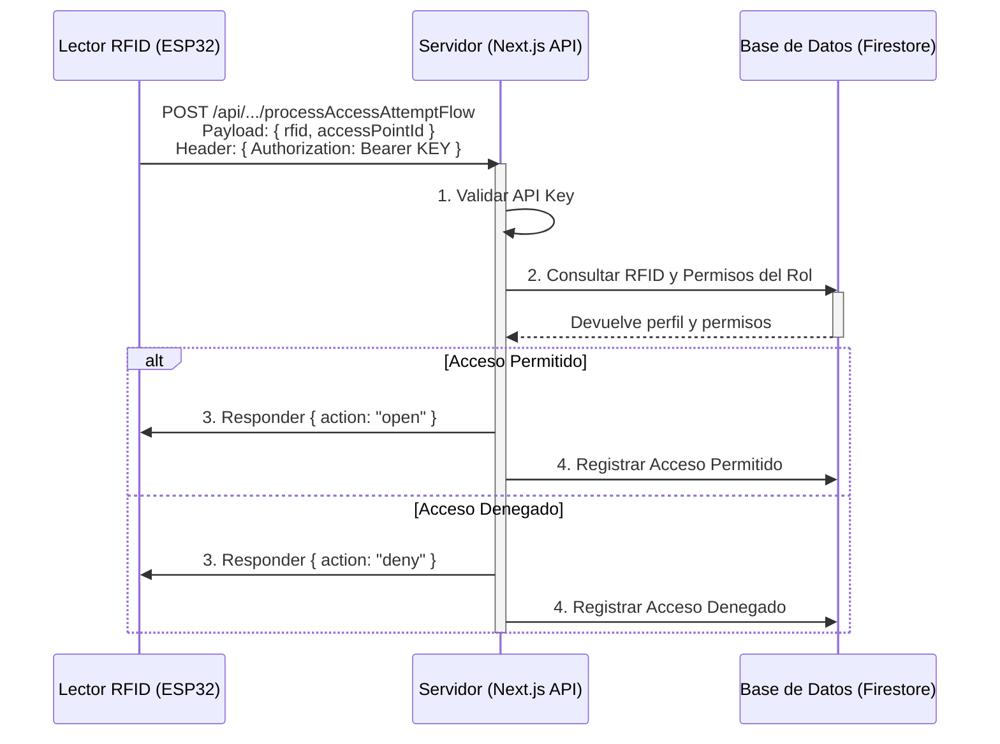

# Arquitectura General de STEM

El Sistema Tecnológico de Educación Modular (STEM) está construido sobre una arquitectura moderna basada en Jamstack, utilizando un stack de tecnologías centrado en JavaScript/TypeScript y los servicios de Firebase.

### Componentes Principales:

1.  **Frontend (Next.js & React):**
    *   La interfaz de usuario es una aplicación de página única (SPA) construida con **Next.js**, un framework de **React**.
    *   Se utiliza el **App Router** de Next.js para el enrutamiento y la renderización del lado del servidor (SSR) y del lado del cliente (CSR).
    *   La interfaz se compone de componentes reutilizables de **ShadCN/UI** y se estila con **Tailwind CSS**.

2.  **Backend (Firebase y Genkit):**
    *   **Firebase** actúa como el Backend-as-a-Service (BaaS) principal.
        *   **Firestore:** Base de datos NoSQL para almacenar toda la información (usuarios, institutos, unidades, etc.).
        *   **Firebase Authentication:** Gestiona el registro y la autenticación de usuarios (email/contraseña y Google).
        *   **Firebase Storage:** Almacena archivos como imágenes de perfil, vouchers de pago y materiales de los cursos.
        *   **Firebase Hosting:** Sirve la aplicación Next.js al público.
    *   **Next.js API Routes:** Se utilizan para crear endpoints específicos del backend, como el que procesa las peticiones del dispositivo RFID.
    *   **Genkit (Google AI):** Se integra a través de server-side flows para proporcionar funcionalidades de inteligencia artificial, como la generación de contenido.

3.  **Dispositivos Físicos (ESP32):**
    *   Los lectores RFID (basados en ESP32) actúan como clientes que consumen la API de Next.js.
    *   Envían peticiones `POST` seguras, autenticadas con una API Key, al endpoint `/api/flow/processAccessAttemptFlow` para validar el acceso.

### Diagrama de Flujo de Datos (Control de Acceso)

### Flujo de Datos Detallado

1.  Un usuario pasa su tarjeta RFID por el lector ESP32.
2.  El ESP32 lee el UID de la tarjeta y construye un payload JSON: `{ "accessPointId": "...", "rfidCardId": "..." }`.
3.  El ESP32 realiza una petición `POST` HTTPS a la URL de producción de la API, incluyendo la API Key en la cabecera `Authorization`.
4.  Firebase Hosting recibe la petición y la enruta a la función de Next.js correspondiente.
5.  El endpoint de la API valida la API Key y luego consulta Firestore para verificar si la tarjeta RFID y el rol del usuario tienen permiso en ese punto de acceso.
6.  La API devuelve una respuesta JSON al ESP32: `{"action": "open"}` o `{"action": "deny"}`.
7.  El ESP32 parsea la respuesta y actúa en consecuencia (ej: abre una puerta).
8.  Paralelamente, la API escribe un registro del intento de acceso en Firestore para auditoría.
